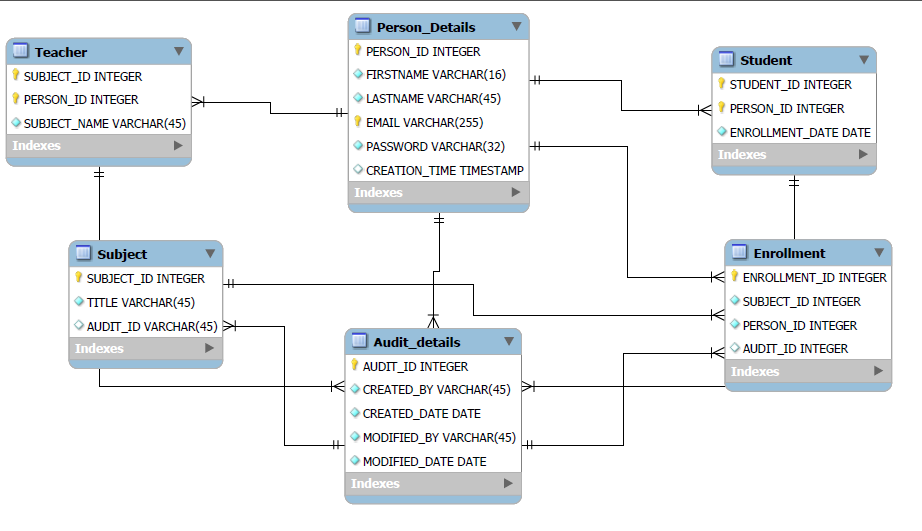

<h1>Login module</h1>

This module is taken by userac

<h2>Database schema</h2>

Have a look at it. it might have mistakes so give your review comments for further improvements. 
Audit details table is basically used to track the changes done by the user it's a kind of storing the history of data to track down the changes done by the user...

<i>Comment from admin: </i>Please adjust the password field. For security reasons, the password is held as a hash in the PasswordHash property rather than as clear text. The PasswordSalt property contains the random salt string appended to the password before it is hashed.

